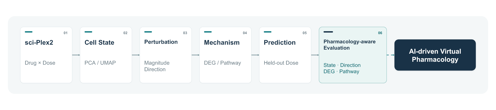
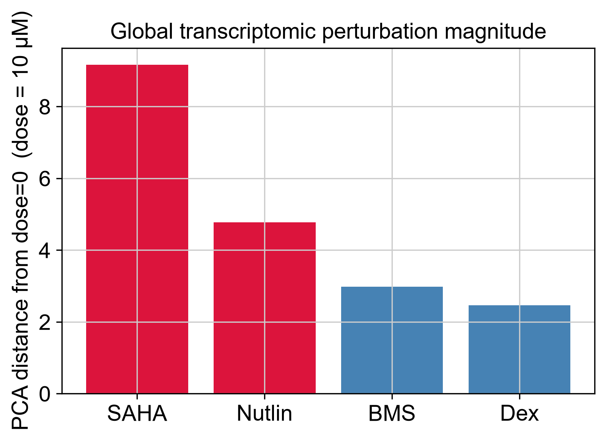
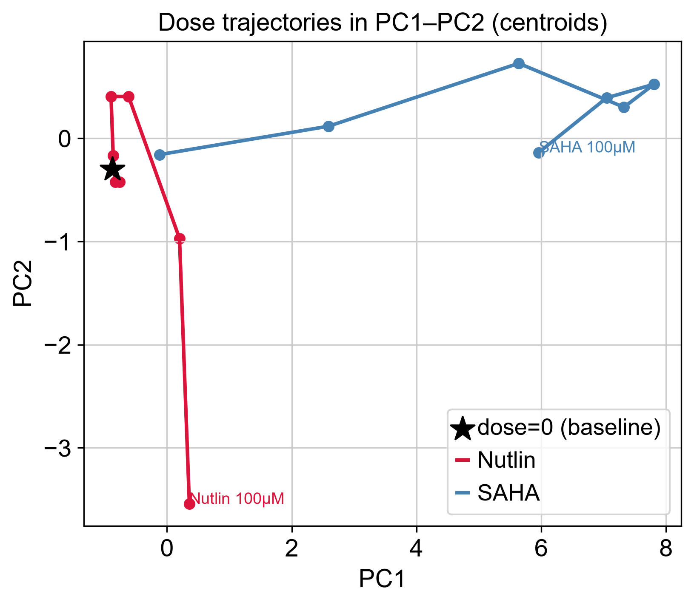
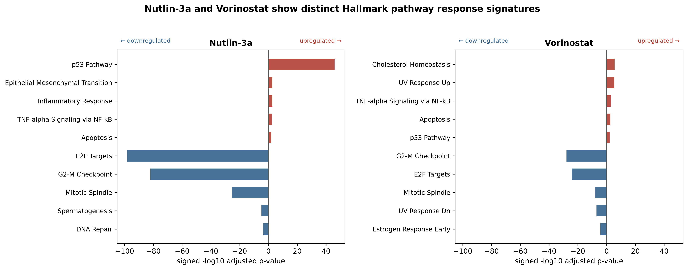
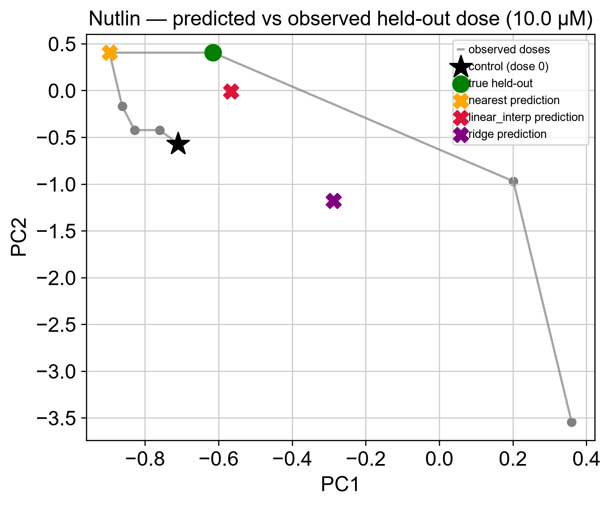
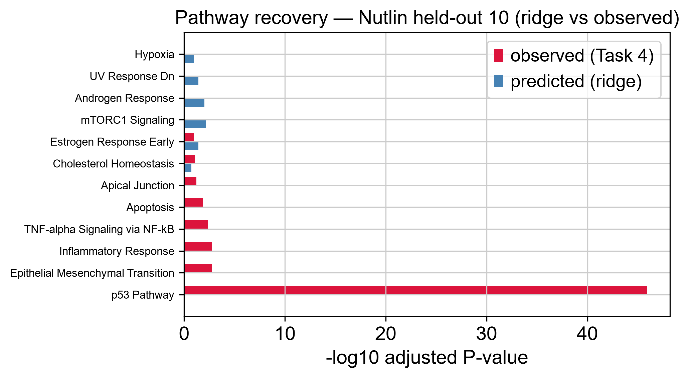

# Single-cell Drug Perturbation Analysis and Predictive Modeling with sci-Plex2

### From dose-dependent cellular responses to predictive perturbation modeling

An independent computational study investigating how drug identity and dose reshape single-cell transcriptional states, and how unobserved drug–dose responses can be predicted and evaluated beyond global reconstruction accuracy.

---

## Project at a Glance

<p align="center">
  
</p>

**Drug + Dose**
→ **Single-cell State**
→ **Perturbation Magnitude & Direction**
→ **DEG / Pathway**
→ **Held-out Dose Prediction**
→ **Pharmacology-aware Evaluation**

---

## Key Findings

**1. Drug responses are dose-dependent but mechanistically distinct**  
Drug identity and dose produced reproducible transcriptional state shifts, while mechanistic analyses revealed distinct drug-associated gene and pathway programs.

**2. Local dose-based baselines outperformed global ridge regression in the tested interpolation task**  
For the tested Nutlin-3a held-out dose, nearest-dose and log-dose interpolation recovered the transcriptional state more accurately than a global ridge model, highlighting the importance of strong baselines in perturbation modeling.

**3. Prediction accuracy does not guarantee pharmacological validity**  
A model may partially recover the average transcriptional state while failing to recover the dominant drug-specific biological program.

---

### Toward AI-driven Virtual Pharmacology

This project motivates a broader question:

> **What does it mean for a perturbation model to be pharmacologically correct?**

This question motivates the pharmacology-aware evaluation framework developed below.

---

## 1. Project Overview

This project uses a focused A549 subset of the sci-Plex2 dataset containing four pharmacological perturbations. Global drug–dose perturbation patterns were characterized across all four compounds, while mechanistic and predictive analyses focused primarily on Nutlin-3a and vorinostat/SAHA, two drugs with distinct pharmacological mechanisms.

- **Nutlin-3a** — MDM2 inhibitor that stabilizes p53
- **Vorinostat / SAHA** — histone deacetylase (HDAC) inhibitor

The project addresses three linked questions:

1. **Phenotype:** How strongly, and in what direction, does a drug shift transcriptional cell state?
2. **Mechanism:** Which genes and pathways underlie the observed state transition?
3. **Prediction:** Can an unobserved drug–dose state be predicted from observed perturbations?

In concrete terms: Task 3 characterizes the **global perturbation landscape across all four compounds**, Task 4 performs **deeper mechanism analysis for Nutlin-3a and vorinostat**, and Task 5 uses **Nutlin-3a as the primary predictive case study**, moving from observation to prediction.

---

## 2. Research Questions

1. Do different drugs induce distinct transcriptional states, and how does response change with dose?

2. Can mechanistically different drugs be distinguished by both the **magnitude** and **direction** of their perturbations?

3. Which genes and pathways explain these state shifts, and are the responses consistent with known pharmacology?

4. Can a held-out drug–dose transcriptional state be predicted from observed conditions?

5. Which evaluation metrics best distinguish numerical prediction accuracy from **pharmacological validity**?

---

## 3. Dataset

- **Source:** `srivatsan_2020_sciplex2`, provided through the `pertpy` package
- **Cell line:** A549 human lung adenocarcinoma cells
- **Compounds:** dexamethasone, Nutlin-3a, BMS-345541, and vorinostat/SAHA
- **Control:** dose-0 / vehicle conditions
- **Dose range:** 0–100 µM
- **Replicate structure:** 6 wells per drug–dose condition
- **Initial scale:** 24,262 cells × 58,347 genes
- **After QC:** 23,628 cells retained

> The `pertpy` sci-Plex2 object used here is a focused A549 / four-compound subset rather than the full sci-Plex screening dataset.

---

## 4. Overall Workflow

| Stage | Notebook | Main purpose |
|---|---|---|
| Task 1 | `01_data_exploration.ipynb` | Understand experimental design and metadata |
| Task 2 | `02_preprocessing_qc.ipynb` | Data-driven QC, normalization, and HVG selection |
| Task 3 | `03_drug_dose_cellstate.ipynb` | Quantify drug–dose perturbation magnitude and direction |
| Task 4 | `04_deg_pathway_analysis.ipynb` | Well-level pseudobulk DEG and pathway analysis |
| Task 5 | `05_predictive_perturbation_modeling.ipynb` | Held-out dose prediction and pharmacology-aware evaluation |

---

## 5. Task 1 — Experimental Design and Data Exploration

The AnnData structure and perturbation-relevant metadata were first mapped before statistical analysis.

Key fields included:

- drug identity: `obs["perturbation"]`
- dose: `obs["dose_value"]`
- replicate unit: `obs["well"]`

The well was treated as the highest available experimental unit for replicate-aware downstream analysis rather than treating individual cells as independent replicates.

Raw UMI counts were retained for count-based differential-expression analysis.

### Key methodological principle

> **Cells from the same experimental well are not independent biological observations.**

This consideration directly motivated the well-level pseudobulk strategy used in Task 4.

---

## 6. Task 2 — Preprocessing and Quality Control

QC thresholds were selected from the observed data distributions rather than copied from generic tutorial defaults.

Because the dataset had already undergone initial filtering, QC focused on identifying unusually low-quality cells and potential outliers while avoiding disproportionate removal of treatment-specific populations.

A mitochondrial-content threshold of 20% and an upper detected-gene threshold of 6,000 were applied.

- **634 cells removed**
- **2.6% of total cells**
- final retention remained approximately **97–98.5% across treatment groups**

An additional technical issue was identified: the un-hashed vehicle-control subset showed substantially lower sequencing depth than the treated samples. It was therefore treated as a technically distinct subset and was not used as the primary baseline for downstream DEG contrasts.

This step highlighted two important considerations:

1. QC should account for experimental context rather than rely on universal thresholds.
2. Technical differences between control and treatment samples can strongly affect downstream inference.

---

## 7. Task 3 — Drug–Dose Perturbation Landscape

PCA, UMAP, and Leiden clustering were used to characterize global transcriptional structure.

Quantitative perturbation analysis was performed in **PCA space**, not UMAP space.

### Perturbation magnitude

Condition-level centroids were used to quantify the distance between dose-0 and treated states.

At a common dose of **10 µM** (the same dose used for the Task 4 DEG contrasts, ensuring a fair drug-to-drug comparison):

- SAHA: ~9.2
- Nutlin-3a: ~4.8
- BMS-345541: ~3.0
- dexamethasone: ~2.5

SAHA therefore produced the largest global transcriptional displacement among the four compounds in this representation.

### Perturbation direction

Drug-response vectors were compared using cosine similarity.

For example:

- Nutlin-3a vs. SAHA: cosine ≈ 0.35
- Nutlin-3a vs. BMS-345541: cosine ≈ 0.96

Importantly, vector similarity in PCA space was interpreted as **similarity of global transcriptional direction**, not as evidence of identical pharmacological mechanism.

### Replicate dispersion

Between-drug centroid distances exceeded within-condition well-to-well dispersion by approximately six-fold.

This suggests that drug-associated transcriptional separation was substantially larger than replicate-level variability.

> **Perturbation magnitude and perturbation direction represent different properties of drug response and should be evaluated separately.**

---

## 8. Task 4 — Differential Expression and Pathway Analysis

Differential expression was performed using a **well-level pseudobulk strategy**.

Raw counts were aggregated by:

**drug × dose × well**

and modeled using `pydeseq2`, preserving the experimental replicate structure rather than treating cells as independent observations.

Primary comparisons included:

- Nutlin-3a 10 µM vs. dose-0
- Vorinostat 10 µM vs. dose-0

| Metric | Nutlin-3a | Vorinostat / SAHA |
|---|---:|---:|
| DEGs (FDR < 0.05) | 2,824 | 7,405 |
| Significant & \|log2FC\| > 1 | 977 | 4,290 |
| Representative enriched programs | p53 pathway | cholesterol / UV-response / TNF-related programs |
| Shared upregulated genes | 130 | 130 |
| Drug-specific upregulated genes | 413 | 2,479 |

### Mechanistic interpretation

Nutlin-3a produced a dominant **p53-associated transcriptional program** (p53 Pathway, adjusted p ≈ 1.3e-46), consistent with inhibition of MDM2-mediated p53 degradation. This was accompanied by strong downregulation of cell-cycle programs (E2F targets, G2M checkpoint, mitotic spindle), consistent with p53-mediated cell-cycle arrest.

Vorinostat induced a broader transcriptional response, consistent with the widespread regulatory effects of HDAC inhibition, with pathway enrichment that was weaker and less target-specific than the Nutlin-3a response.

Under the selected DEG thresholds, only ~130 upregulated genes were shared between the two drug responses, while SAHA produced a much larger overall DEG set.

These results support the view that similar global perturbation strength does not necessarily imply similar underlying biology.

---

## 9. Task 5 — Predictive Perturbation Modeling

The final task moves from descriptive perturbation analysis toward **predictive perturbation modeling**.

A full drug–dose condition was held out during model fitting.

Two settings were considered:

### Dose interpolation

A dose within the observed range was hidden:

**held-out: 10 µM**

### Near-range extrapolation

An edge / high-dose condition was hidden:

**held-out: 100 µM**

Simple baselines were evaluated before introducing more complex models:

- control-state baseline
- nearest observed dose
- log-dose interpolation
- ridge regression from log-dose to PCA representation

Example results for **Nutlin-3a 10 µM interpolation**:

| Model | PCA error | Direction recovery |
|---|---:|---:|
| Control baseline | 4.76 | — |
| Nearest observed dose | 1.01 | 0.99 |
| Log-dose interpolation | 1.08 | 0.99 |
| Ridge regression | 3.22 | 0.80 |

For this held-out condition, **local dose-based baselines substantially outperformed the global ridge model**.

This suggests that the tested dose trajectory contains strong local smoothness but is not adequately captured by a simple global linear model.

More importantly, numerical state prediction and mechanism recovery were not equivalent.

For example, the ridge-predicted transcriptional state produced pathway signals dominated by generic stress-related programs rather than recovering the observed Nutlin-3a p53 program.

Thus:

> **Low state-space prediction error does not guarantee recovery of the correct pharmacological mechanism.**

---

## 10. Pharmacology-aware Evaluation

Prediction was evaluated not only as a numerical reconstruction problem but also as a pharmacological one.

### State-space accuracy

- PCA prediction error

### Perturbation magnitude

- recovery of the control → treatment displacement

### Perturbation direction

- cosine similarity between observed and predicted perturbation vectors

### Gene-level recovery

- whole-transcriptome correlation
- perturbation-responsive gene correlation

### Mechanism recovery

- DEG consistency
- pathway enrichment consistency

### Replicate reproducibility

- key responses assessed across replicate wells rather than only at the pooled population average

Whole-transcriptome correlations approached saturation across models because the majority of genes were minimally changed.

Restricting the evaluation to perturbation-responsive genes produced substantially greater separation:

- nearest / interpolation: ~0.996
- ridge: ~0.942
- control: ~0.797

Pathway recovery provided an even more discriminating biological criterion in this analysis.

### Central methodological lesson

> **Gene-level correlation does not necessarily equal pharmacological validity.**

A useful perturbation model should recover not only the average transcriptional state, but also the **direction, dose dependence, responsive genes, and biological programs** that define the pharmacological response.

---

## 11. Methodological Lessons

- **Cells ≠ independent replicates:** inference should preserve the well-level experimental structure.
- **Magnitude ≠ mechanism:** similar perturbation strength can arise from distinct biological programs.
- **UMAP ≠ quantitative distance:** quantitative perturbation comparisons were performed in PCA space.
- **Interpolation ≠ extrapolation:** these represent fundamentally different generalization settings.
- **Prediction accuracy ≠ pharmacological validity:** global reconstruction metrics can obscure mechanism-level failures.

---

## 12. Representative Results

### Drug-specific perturbation magnitude



At a common dose of 10 µM, SAHA produced the largest global transcriptional displacement among the four compounds, whereas dexamethasone produced the smallest.

---

### Perturbation magnitude and direction



Nutlin-3a and vorinostat follow clearly different dose trajectories in PCA space, showing that perturbation magnitude and global transcriptional direction capture complementary aspects of drug response.

---

### Drug-specific pathway responses



Nutlin-3a induces a dominant p53-associated upregulated program together with strong downregulation of cell-cycle pathways, whereas vorinostat shows a broader transcriptional response with weaker but detectable suppression of cell-cycle programs. Positive values indicate upregulated pathways; negative values indicate downregulated pathways.

---

### Held-out dose prediction



For the tested Nutlin-3a 10 µM interpolation task, nearest-dose and local interpolation baselines more closely recovered the observed held-out state than the global ridge model.

---

### Mechanism-level prediction failure



Despite partially reconstructing the held-out transcriptional state, the ridge model failed to recover the dominant observed Nutlin-3a p53-associated program, illustrating the distinction between state reconstruction and mechanism recovery.

---

## 13. Repository Structure

```text
single-cell-drug-perturbation/
│
├── README.md
├── requirements.txt
├── .gitignore
├── LICENSE
│
├── notebooks/
│   ├── 01_data_exploration.ipynb
│   ├── 02_preprocessing_qc.ipynb
│   ├── 03_drug_dose_cellstate.ipynb
│   ├── 04_deg_pathway_analysis.ipynb
│   └── 05_predictive_perturbation_modeling.ipynb
│
├── figures/
│   ├── overview/
│   ├── perturbation_landscape/
│   ├── deg_pathway/
│   └── prediction/
│
├── results/
│   └── summary_tables/
│
└── docs/
    └── project_notes.md
```

---

## 14. Tools and Methods

**Language**

- Python 3.11

**Single-cell analysis**

- Scanpy
- AnnData
- pertpy

**Differential expression**

- PyDESeq2
- replicate-aware / well-level pseudobulk

**Pathway analysis**

- GSEApy
- MSigDB Hallmark

**Representation and clustering**

- PCA
- UMAP
- Leiden

**Predictive modeling**

- scikit-learn
- ridge regression
- dose-based interpolation baselines

**Data processing and visualization**

- NumPy
- SciPy
- pandas
- Matplotlib

---

## 15. Limitations

This project is intentionally a focused perturbation-modeling study rather than a full Virtual Cell model.

Current limitations include:

- analysis focuses on one cancer cell line and a limited set of compounds;
- replicate structure is limited to the available experimental wells;
- transcriptional state is only one layer of pharmacological response;
- no direct phenotypic or experimental validation is included;
- held-out dose prediction is substantially easier than unseen-drug or unseen-context generalization;
- the current predictive model operates on condition-level average states rather than full single-cell response distributions;
- simple regression models do not fully capture nonlinear, mechanism-specific perturbation dynamics.

---

## 16. Next Steps — Toward Virtual Pharmacology

This project establishes a condition-level framework for analyzing and predicting drug–dose perturbations, while highlighting the gap between **state reconstruction** and **pharmacological mechanism recovery**.

Immediate methodological extensions include:

1. testing generalization across additional drugs and dose trajectories;
2. extending evaluation across different cellular contexts;
3. moving from average-state prediction toward single-cell distributional responses;
4. incorporating time and exposure into perturbation modeling;
5. evaluating models jointly by state accuracy, dose-response behavior, mechanism recovery, and out-of-distribution generalization.

In the longer term, perturbation models could serve as one evidence layer within an **AI-driven Virtual Pharmacology** framework integrating cellular response prediction with drug-target knowledge, PK/exposure, safety, and clinical evidence.

> **The broader goal is not only to predict what a cell will do after perturbation, but to evaluate which intervention is pharmacologically meaningful under a given biological state and exposure condition.**

---

## Data Citation

Srivatsan SR, McFaline-Figueroa JL, Ramani V, et al.  
Massively multiplex chemical transcriptomics at single-cell resolution.  
*Science*. 2020;367(6473):45–51.  
doi: 10.1126/science.aax6234.

The focused sci-Plex2 dataset used in this project was accessed through `pertpy`.
